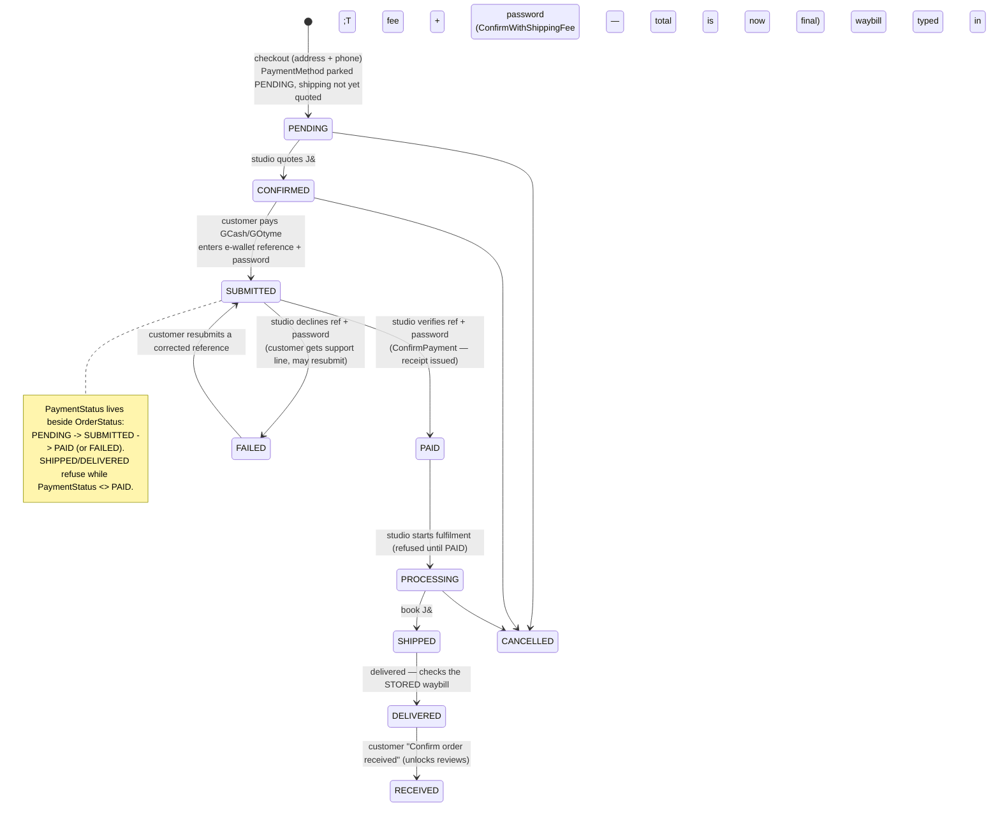

# Architecture

STAR:DOM is a single ASP.NET Web Forms site (one process, one .NET Framework
4.8 AppDomain) in front of one PostgreSQL database. There is no API tier, no
ORM and no client-side framework — the browser gets HTML, CSS and a little
vanilla JavaScript.

## Runtime request path

```mermaid
flowchart TD
    B[Browser / customer, admin, owner]

    subgraph Host[Windows machine or Render container]
        direction TB
        R["run-website.bat<br/>share-website.bat<br/>(load tools\supabase-env.bat, then IIS Express :8095<br/>or Mono/XSP4 in Docker)"]

        subgraph Web[STAR-DOM-Web — ASP.NET Web Forms]
            direction TB
            PAGES["App\*.aspx + .aspx.vb<br/>Marketplace · Catalog · Product · Cart · Checkout<br/>OrderDetail · Orders · Commissions · Reviews<br/>Profile · Notifications · Receipt"]
            ADM["App\Admin + App\Merchant<br/>Users · PaymentSettings<br/>Dashboard · Products · Events · Pipeline · Orders · Reports"]
            QR["App\PaymentQr.aspx<br/>streams PaymentSettings.QrImageData (BYTEA)<br/>ETag + HEAD, 1x1 GIF fallback"]
            MSTR["Shared\Site.master<br/>shell, CSRF token, sign-in gate"]
        end

        subgraph Core[Code\ — web helpers]
            GUARD["Guard.vb — role gates"]
            CSRF["Csrf.vb — per-session POST token<br/>verified in Global.asax.vb"]
            WEBUI["WebUi.vb — branding, QrPaymentModal, helpers"]
            SESS["Helpers\Session.vb · Validators · ChartSeries"]
        end

        subgraph Biz[Shared\ — Models · Repositories · Services]
            SVC["Services<br/>Auth · Cart · Catalog · Order · Commission<br/>Event · Report · Notification"]
            REPO["Repositories (11)<br/>User · Product · Category · Cart · Order<br/>PaymentSetting · Commission · Event · Receipt · Report · Notification"]
            MODEL["Models (7) + Reports\ReportDtos<br/>Helpers: PasswordHasher · Fmt · AppColors · Clock"]
        end

        DB["Code\Db.vb<br/>ConnString() = env vars → Db_* → web.config<br/>UriToConnString() for postgresql:// URIs"]
    end

    subgraph Data[PostgreSQL]
        direction TB
        LOCAL["Local fallback<br/>tools\pgsql (vendored 16.4) + tools\pgdata<br/>db 'stardom' — per machine"]
        SUPA["Supabase project (shared, PostgreSQL 17.6)<br/>Session pooler :5432, SSL required"]
        TABLES["29 tables<br/>users · products · orders · payments · carts<br/>events · booths · commissions · reviews · notifications<br/>paymentsettings.qrimagedata BYTEA"]
    end

    B -->|GET / POST /| R
    R --> PAGES
    R --> ADM
    R --> QR
    PAGES --> MSTR
    ADM --> MSTR
    PAGES --> GUARD
    PAGES --> WEBUI
    ADM --> GUARD
    GUARD --> SESS
    WEBUI --> SESS
    PAGES --> SVC
    ADM --> SVC
    QR --> REPO
    SVC --> REPO
    SVC --> MODEL
    REPO --> MODEL
    REPO --> DB
    QR --> DB
    DB -->|"tools\supabase-credentials.txt exists"| SUPA
    DB -->|"set SD_LOCAL_DB=1"| LOCAL
    SUPA --> TABLES
    LOCAL --> TABLES
    CSRF -.->|"403 + AppErrors on mismatch"| PAGES
```

## Layer rules

| Layer | May call | Must not |
|---|---|---|
| `App\*.aspx.vb` | `Code\*`, `Shared\Services\*` | touch `Npgsql` directly |
| `App\PaymentQr.aspx.vb` | `Shared\Repositories\PaymentSettingRepository` | render HTML — it only streams bytes |
| `Shared\Services` | `Shared\Repositories`, `Shared\Models` | know about `HttpContext` |
| `Shared\Repositories` | `Shared\Models`, `Code\Db.vb` | build HTML or write business rules |
| `Shared\Models` | nothing | contain behaviour beyond validation |

Everything is parameterised SQL through Npgsql 4.1.10; there is no ORM and no
string-concatenated query anywhere. `Code\Db.vb` is the single place that knows
which database it is talking to, which is why switching between Supabase and
the local copy is an environment variable and not a code change.

## Two endpoints worth knowing

- **`App\PaymentQr.aspx?ch=GCASH|GOTYME`** — the wallet QR codes live in
  `paymentsettings.qrimagedata` (`BYTEA`), not on disk. This page streams the
  bytes with an `ETag`, answers `HEAD`, and returns a 1×1 GIF when a channel has
  no image yet, so no `` ever breaks. `paymentsettings.qrimagefile` is read
  only as a fallback for rows uploaded by an older build.
- **`Global.asax.vb`** — `Application_AcquireRequestState` is where the CSRF
  token is verified for every POST, because pages emit their own raw
  `<form method="post">` markup rather than going through a control.

## Order & payment state machine — the one place with states

There is no payment method at checkout: the studio must first quote the J&T
fee — which is what makes the total final — so the customer pays only after
the order comes back quoted. The two-step payment verification means one side
alone can never complete a payment.

The Scan-to-Pay popup is generated once by `WebUi.QrPaymentModal` and shown
from **Order Detail** (checkout has no popup any more — the order is written
immediately and payment waits until the fee is quoted).

---

The repository-layout picture below is rendered by GitDiagram from the GitHub
repo and is therefore refreshed by pushing; the diagrams above are hand-written
and always current.

